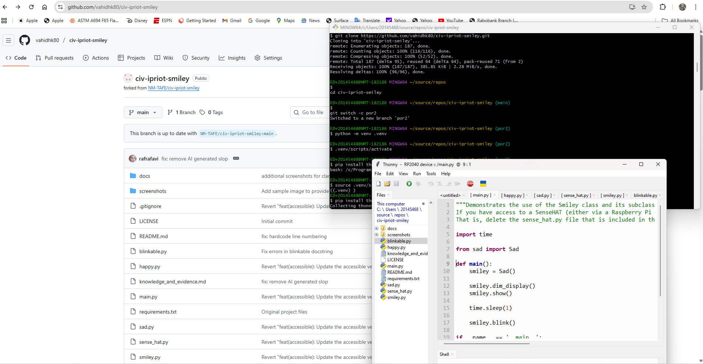
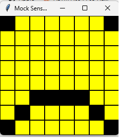
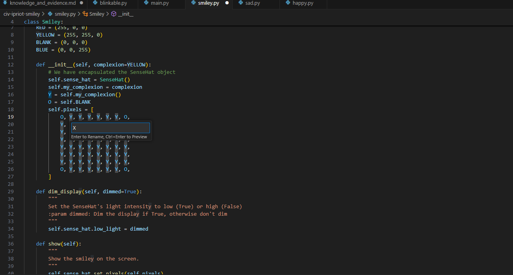

# Evidence and Knowledge

This document includes instructions and knowledge questions that must be completed to receive a *Competent* grade on this portfolio task.

## 1. Required evidence

### 1.1. Answer all questions in this document

- Each answer should be complete, well-articulated, and within the specified word count limits (if added) for each question.
- Please make sure **all** external sources are properly cited.
- You must **use your own words**. Please include your full chat transcripts if you use generative AI in any way.
- Generative AI hallucinates, is not an authoritative source

### 1.2. Make all the required modifications to the code

- Please follow the instructions in this document to make the changes needed to the code.

- When requested to upload evidence, upload all screenshots to `screenshots/` and embed them in this document. For example:

```markdown

```


> Note the `!`, and the use of a relative path.

- You must upload the code into your GitHub repository.
- While you can use a branch, your code should be in main when you submit.
- Upload a zip of this repository to Blackboard when you are ready to submit.
- You will be notified of your result via Blackboard
- However, if using GitHub classrooms, you may also receive additional feedback on GitHub directly

### 1.3. Optional: Use of Raspberry Pi and SenseHat

Raspberry Pi or SenseHat is **optional** for this activity. You can use the included `sense_hat.py` file to simulate the SenseHat on your computer.

If you use a Pi, please **delete** the `sense_hat.py` file.

### 1.4. Accessible version of the code

This project relies on visual patterns that appear on an LED matrix. If you have any accessibility requirements, you can use the `udl/accessible` branch to complete the project. This branch provides an accessible code version that uses text-based patterns instead of visual ones.

Please discuss this with your lecturer before using that branch.

## 2. Specific Tasks & Questions

Address the following tasks and questions based on the code provided in this repository.

### 2.1. Set up the project locally

1. Fork this repository (if not using GitHub Classrooms)
2. Clone your repository locally
3. Run the project locally by executing the `main.py` file
4. Evidence this by providing screenshots of the project directory structure and the output of the `main.py` file



If you are running on a Raspberry Pi, you can use the following command to run the project and then screenshot the result:

```bash
ls
python3 main.py
```

### 2.2. Fundamental code comprehension

 Answer each of the following questions **as they relate to that code** supplied by in this repository (ignore `sense_hat.py`):

1. Examine the code for the `smiley.py` file and provide  an example of a variable of each of the following types and their corresponding values (`_` should be replaced with the appropriate values):

   | Type                    | name       | value          |
   | ----------              | ---------- | -------------- |
   | built-in primitive type | dimed      | True           |
   | built-in composite type | WHITE      | (255, 255, 255)|
   | user-defined type       | Smiley     |  _             |

2. Fill in (`_`) the following table based on the code in `smiley.py`:

   | Object                   | Type                    |
   | ------------             | ----------------------- |
   | self.pixels              | built-in composite      |
   | A member of self.pixels  | built-in primitive      |
   | self                     |  user-defined type      |

3. Examine the code for `smiley.py`, `sad.py`, and `happy.py`. Give an example of each of the following control structures using an example from **each** of these files. Include the first line and the line range:

   | Control Flow | File       | First line                | Line range  |
   | ------------ | ---------- | -----------               | ----------- |
   |  sequence    |smiley.py   |self.sense_hat = SenseHat()|line 13 to 26|
   |  selection   |sad.py      |if wide_open:              |line 26 to 29|
   |  iteration   |happy.py    |for pixel in mouth:        |line 21 to 22|

4. Though everything in Python is an object, it is sometimes said to have four "primitive" types. Examining the three files `smiley.py`, `sad.py`, and `happy.py`, identify which of the following types are used in any of these files, and give an example of each (use an example from the code, if applicable, otherwise provide an example of your own):

   | Type                    | Used? | Example |
   | ----------------------- | ----- | --------|
   | int                     | yes   |i        |
   | float                   | no    | _       |
   | str                     | no    | _       |
   | bool                    | yes   |wide_open|

5. Examining `smiley.py`, provide an example of a class variable and an instance variable (attribute). Explain **why** one is defined as a class variable and the other as an instance variable.

> class variable: YELLOW, becuase it's defined at the class level. if we change it, this variable will be changed for all the instances.
> instance variable: self.pixels, becuase it's defined using self and in the __init__ method.
  

6. Examine `happy.py`, and identify the constructor (initializer) for the `Happy` class:
   1. What is the purpose of a constructor (in general) and this one (in particular)?

   > the purpose of a constructor is to initialise the object's attributes when new instance is created. e.g. in the class Happy it initialises its attributes when an instance of Happy created.  
   >

   2. What statement(s) does it execute (consider the `super` call), and what is the result?

   > because it inherits from Smiley and Blinkable, in the __init__, super().__init__() calls the parent's class constructor so self.sense_hat, self.pixels and self.BLANK and self. YELLOW will be initialise. also two methods drw_mouth() and draw_eyes().
   >

### 2.3. Code style

1. What code style is used in the code? Is it likely to be the same as the code style used in the SenseHat? Give to reasons as to why/why not:

> PEP8, this code style is not used in the SenseHat, bacause in the case of using, there should be comments and explanations for each part of the code, such as the class and ... 
>

2. List three aspects of this convention you see applied in the code.

> more readablity of the code, more traceability of the code and proper spacing makes structure and logic clear.
>

3. Give two examples of organizational documentation in the code.

> line 26 and line 40
>

### 2.4. Identifying and understanding classes

> Note: Ignore the `sense_hat.py` file when answering the questions below

1. List all the classes you identified in the project. Indicate which classes are base classes and which are subclasses. For subclasses, identify all direct base classes.
  
  Use the following table for your answers:

| Class Name | Super or Sub? | Direct parent(s) |
| ---------- | ------------- | ---------------- |
| Smiley     | Super         | NA               |
| Sad        | Sub           | Smiley           |
| Happy      | Sub           | Smiley, Blinkable|
| Blinkable  | Sub           | ABC              |


2. Explain the concept of abstraction, giving an example from the project (note "implementing an ABC" is **not** in itself an example of abstraction). (Max 150 words)

> Abstraction is the process of removing certain attributes to focus attention on details of greater importance. 
In this project, the Blinkable class is an example of abstraction. It defines the idea that something can blink, but it doesn’t explain exactly how blinking happens. That part is left for other classes, like Happy, to fill in. This specification keeps the code simple and focused. We only deal with the important concept, the ability to blink without worrying about the detailed steps behind it. If we ever want to change how blinking works, we can do that in the subclass without changing the main idea.
>

3. What is the name of the process of deriving from base classes? What is its purpose in this project? (Max 150 words)

> inheritance. it allows a new class to reuse and extend the behaviour of existing class without any need to rewriting same code. in this project Happy inherits all attrbiutes and methods of the Smiley and Blinkable and adds it's own attributes and methods.
>

### 2.5. Compare and contrast classes

Compare and contrast the classes Happy and Sad.

1. What is the key difference between the two classes?
   > Sad has one parents as Smiley, Happy has two parrents as Smiley and Blinkable
   > Happy has blink method.
2. What are the key similarities?
   > both of them has same methods draw_mouth and draw_eyes.
   >both of them has Smiley as their parent. so inherit its attributes and methods.
3. What difference stands out the most to you and why?
   > Sad doesn't have blink
   >
4. How does this difference affect the functionality of these classes
   > when we run the main, with considering smiley=Sad(), we face with an error, becuase Sad doesn't have the blink method.
   >

### 2.6. Where is the Sense(Hat) in the code?

1. Which class(es) utilize the functionality of the SenseHat?
   > Smiley
   >
2. Which of these classes directly interact with the SenseHat functionalities?
   > Smiley
   >
3. Discuss the hiding of the SenseHAT in terms of encapsulation (100-200 Words)
   > In the Smiley class, the SenseHat is hidden inside the class, this is called encapsulation. It means that other parts of the program cannot see or change the SenseHat directly. Instead, they can only use special methods like show() or dim_display() that the class provides. This is useful because it protects the SenseHat from being used in the wrong way and keeps the code easier to manage. For example, if something changes in how the SenseHat works, we only need to update the Smiley class, not all the other classes like Happy or Sad. So, encapsulation helps to hide complex details and lets other classes use the smiley display without worrying about how it actually works.
   >

### 2.7. Sad Smileys Can’t Blink (Or Can They?)

Unlike the `Happy` smiley, the current implementation of the `Sad` smiley does not possess the ability to blink. Let's first explore how blinking has been implemented in the Happy Smiley by examining the blink() method, which takes one argument that determines the duration of the blink.

**Understanding Blink Mechanism:**

1. Does the code's author believe that every `Smiley` should be able to blink? Explain.

> yes, becuase smiley.blink() command is used, so author believes that all the classes have blink methods.
>

2. For those smileys that blink, does the author expect them to blink in the same way? Explain.

> no. depend on the smiley = Happy() or smiley = Sad() blinking can be done in different way. becuase blink is defiend in Sad and Happy separately.
>

3. Referring to the implementation of blink in the Happy and Sad Smiley classes, give a brief explanation of what polymorphism is.

> Polymorphism means “many forms.” In programming, it allows different classes to use the same method name but behave in their own way. so blink is a method that is defined in Happy class and can be defined in Sad but with different result.
>

4. How is inheritance used in the blink method, and why is it important for polymorphism?

> in Happy class, the blink method is inherited from Blinkable class, but redefine in the Happy class so it's overrided.   
>
1. **Implement Blink in Sad Class:**

   - Create a new method called `blink` within the Sad class. Ensure you use the same method signature as in the Happy class:

   ```python
   def blink(self, delay=0.25):
       pass  # Replace 'pass' with your implementation
   ```

2. **Code Implementation:** Implement the code that allows the Sad smiley to blink. Use the implementation from the Happy Smiley as a reference. Ensure your new method functions similarly by controlling the blink duration through the `delay` argument.

3. **Testing the Implementation:**

- Test the new blink functionality on your Raspberry Pi or within the Python classes provided. You might need to adjust the `main.py` script to incorporate Sad Smiley's new blinking capability.

Include a screenshot of the sad smiley or the modified `main.py`:



- Observe and document the Sad smiley as it blinks its eyes. Describe any adjustments or issues encountered during implementation.

  > when i added blink() method in the Sad class, the eyes are closed, but they are not opened again!, it's becuase i did not import time in the sad.py code.

  ### 2.8. If It Walks Like a Duck…

  Previously, you implemented the blink functionality for the Sad smiley without utilizing the class `Blinkable`. Assuming you did not use `Blinkable` (even if you actually did), consider how the Sad smiley could blink similarly to the Happy smiley without this specific class.

  1. **Class Type Analysis:** What kind of class is `Blinkable`? Inspect its superclass for clues about its classification.

     > subclass, 

  2. **Class Implementation:** `Blinkable` is a class intended to be implemented by other classes. What generic term describes this kind of class, which is designed for implementation by others? **Clue**: Notice the lack of any concrete implementation and the naming convention.

  > Abstract class

  3. **OO Principle Identification:** Regarding your answer to question (2), which Object-Oriented (OO) principle does this represent? Choose from the following and justify your answer in 1-2 sentences: Abstraction, Polymorphism, Inheritance, Encapsulation.

  > it defines what a class should do (by declaring the blink() method) but not how to do it. This hides unnecessary implementation details and lets other classes (like Happy) provide their own specific version — a clear example of abstraction in object-oriented design.

  4. **Implementation Flexibility:** Explain why you could grant the Sad Smiley a blinking feature similar to the Happy Smiley's implementation, even without directly using `Blinkable`.

  > becuase the blink method is defiend in the Sad class, and Blinkable doesn't have any other method or attributes that need to be used for blinking.

  5. **Concept and Language Specificity:** In relation to your response to question (4), what is this capability known as, and why is it feasible in Python and many other dynamically typed languages but not in most statically typed programming languages like C#? **Clue** This concept is hinted at in the title of this section.

  > Duck typing: It means that in Python, if something looks like it can do a job — for example, it has a blink() method — then Python treats it as able to do that job, even if it doesn’t officially inherit from Blinkable. This works because Python checks things while the program is running (dynamic typing). But in languages like C#, the computer checks types before running the program (static typing).

  ***

  ## 3. Refactoring

  ### 3.1. Does a Smiley Have to Be Yellow?

  While our current implementation predominantly features yellow smileys, emotional expressions like sickness or anger typically utilize colors like green, red, or orange. We'll explore the feasibility of integrating these colors into our smileys.

  1. **Defined Colors and Their Location:**

     1. Which colors are defined and in which class(s)?
        > white, green, red, yellow and blank are defined in Smiley class
     2. What type of variables hold these colors? Are the values expected to change during the program's execution? Explain your answer.
        > tuple type. no, because these are the codes that will be used exactly for each of the colors and for this reason they are held in tuple vraible to be fixed. 
     3. Add the color blue to the appropriate class using the appropriate format and values.

  2. **Usage of Color Variables:**

     1. In which classes are the color variables used?
        > Directly in Smiley, and in other classes, Happy and Sad, becuase inherit from Smiley, 

  3. **Simple Method to Change Colors:**
  4. What is the easiest way you can think to change the smileys to green? Easiest, not necessarily the best!
     > changing Y varialbe in def __init__(self) in Smiley class. but in this case the eyes are still yellow, so it should be changed separately in the def draw_eyes function of both Sad and Happy classes.


  ### 3.2. Flexible Colors – Step 1

  Changing the color of the smileys once is straightforward, but it isn't very flexible. To facilitate various colors for smileys, it is advisable not to hardcode values in any class. This approach was identified earlier as a necessary change. Let's start by removing the built-in assumptions about color in our classes.

  1. **Add a method called `complexion` to the `Smiley` class:** Implement this instance method to return `self.YELLOW`. Using the term "complexion" instead of "color" provides a more abstract terminology that focuses on the meaning rather than implementation.

  2. **Refactor subclasses to use the `complexion` method:** Modify any subclass that directly accesses the color variable to instead utilize the new `complexion` method. This ensures that color handling is centralized and can be easily modified in the future.

  3. **Determine the applicable Object-Oriented principle:** Consider whether Abstraction, Polymorphism, Inheritance, or Encapsulation best applies to the modifications made in this step.

  4. **Verify the implementation:** Ensure that the modifications function as expected. The smileys should still display in yellow, confirming that the new method correctly replaces the direct color references.

  This step is crucial for setting up a more flexible system for color management in the smiley display logic, allowing for easy adjustments and extensions in the future.

  ### 3.3. Flexible Colors – Step 2

  Having removed the hardcoded color values, we now enhance the base class to support dynamic color assignments more effectively.

  1. **Modify the `__init__()` method in the `Smiley` class:** Introduce a default argument named `complexion` and assign `YELLOW` as its default value. This allows the instantiation of smileys with customizable colors.

  2. **Introduce a new instance variable:** Create a variable called `my_complexion` and assign the `complexion` parameter to it. This step ensures that each smiley instance can maintain its own color state.

  3. **Rationale for `my_complexion`:** Using a distinct instance variable like `my_complexion` avoids potential conflicts with the method parameter names and clarifies that it is an attribute specific to the object.

  4. **Bulk rename:** We want to update our grid to use the value of complexion, but we have so many `Y`'s in the grid. Use your IDE's refactoring tool to rename all instances of the **symbol** `Y` to `X`. Where `X` is the value of the `complexion` variable. Include a screenshot evidencing you have found the correct refactor tool and the changes made.

  

  5. **Update the `complexion` method:** Adjust this method to return `self.my_complexion`, ensuring that whatever color is assigned during instantiation is what the smiley displays.

  6. **Verification:** Run the updated code to confirm that Smileys still defaults to yellow unless specified otherwise.

  ### 3.4. Flexible Colors – Step 3

  With the foundational changes in place, it's now possible to implement varied smiley colors for different emotional expressions.

  1. **Adjust the `Sad` class initialization:** In the `Sad` class's initializer method, change the superclass call to include the `complexion` argument with the value `self.BLUE`, as shown:

     ```python
     super().__init__(complexion=self.BLUE)
     ```

  2. **Test color functionality for the Sad smiley:** Execute the program to verify that the Sad smiley now appears blue.

  3. **Ensure the Happy smiley remains yellow:** Confirm that changes to the Sad smiley do not affect the default color of the Happy smiley, which should still display in yellow.

  4. **Design and Implement An Angry Smiley:** Create an Angry smiley class that inherits from the `Smiley` class. Set the color of the Angry smiley to red by passing `self.RED` as the `complexion` argument in the superclass call.

  ***
